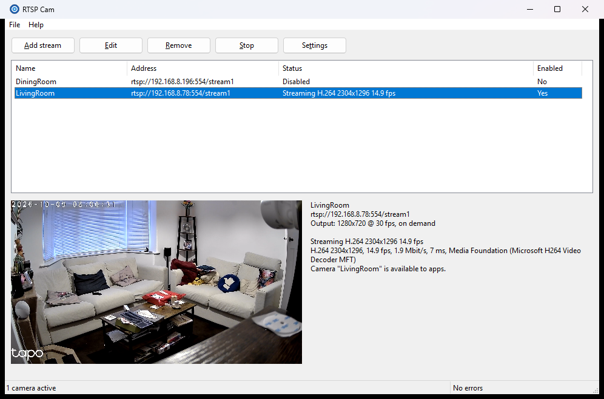
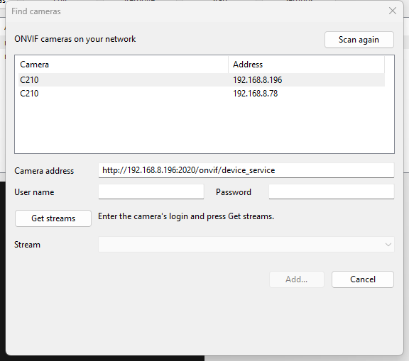

# RTSP Cam

A Windows 11 desktop app, written in Rust, that turns RTSP streams from IP cameras, NVRs or
`mediamtx` into **webcams**. Each stream shows up as its own camera (for example
"Front Door – Windows Virtual Camera") in Discord, Teams, Zoom, OBS, Chrome/Edge and the
Windows Camera app.

It uses the Windows 11 Media Foundation virtual camera API (`MFCreateVirtualCamera`), so no
kernel driver is needed. Cameras exist only while the app is running.

> **Status:** early development. The RTSP pipeline (Phase 2) works from the developer CLI. The
> virtual camera media source (Phase 3) is built and tested in-process but not yet verified in
> camera apps. The desktop app and UI (Phases 4–5) are built and run, but the cameras have only been
> checked through Frame Server with a test pattern, not yet in Discord or other apps. Camera
> discovery, brand presets, import/export and picture options (Phase 6) are built and were tried
> against real ONVIF cameras. The installer (Phase 7) builds but has not been run on a clean PC. See the [implementation plan](documentation/01-plan.md) and the
> progress records ([2–3](documentation/03-progress-phases-2-3.md),
> [4–5](documentation/05-progress-phases-4-5.md), [6](documentation/07-progress-phase-6.md), [7](documentation/08-progress-phase-7.md)) and the
> [checkpoint](documentation/06-checkpoint-2026-10-09.md).



## Quickstart

Needs the [requirements](#requirements) below (Windows 11, Rust, Visual Studio Build Tools).
Run these from the repository root in PowerShell.

**Build and run the app**

```powershell
cargo run -p rtspcam-app                 # debug build, opens the window
```

Click **Add stream**, enter the camera's IP address (plus user name and password), use
**Test connection**, then **OK**. The stream's live preview appears in the window.
Config is saved to `%APPDATA%\RtspCam\config.json`, logs go to `%LOCALAPPDATA%\RtspCam\logs`.

Or click **Find cameras**: ONVIF cameras on your network are listed. Pick one, enter its
login, **Get streams**, choose the main or sub stream, and the Add dialog opens filled in.



Other ways to fill in the address: the **Camera brand** box in the Add dialog sets the port and
path for Hikvision, Dahua, Amcrest, Reolink, Tapo, UniFi Protect, Axis and Foscam; **Picture...**
rotates, flips, crops, adds the name or the time, and chooses what apps see when the stream
drops; **File > Export / Import streams** moves streams between PCs (passwords are not included).

**Make the cameras appear in Discord, OBS, the Camera app, ...** (one-time, needs admin)

```powershell
cargo build -p rtspcam-cli -p rtspcam-vcam
./tools/vcam/install-dev.ps1             # asks for elevation (UAC)
```

Without this the preview works but each camera shows "Access is denied". Restart Discord
after adding a camera so it re-lists devices. Rebuild and re-run the script after changing
the DLL. `./tools/vcam/install-dev.ps1 -Uninstall` removes it.

**Build an exe**

```powershell
cargo build -p rtspcam-app --release     # -> target\release\rtspcam.exe
```

The release build is a windowed app (no console) with the manifest embedded. The optional
flags are `--minimized` (start in the tray) and `--headless` (no window, Ctrl+C quits). The
exe is self-contained apart from `rtspcam_vcam.dll`, which is built with
`cargo build -p rtspcam-vcam --release` and installed with
`./tools/vcam/install-dev.ps1 -Configuration release`. For other PCs, build the installer instead (below).

**Build an installer** (needs [Inno Setup 6](https://jrsoftware.org/isinfo.php): `winget install JRSoftware.InnoSetup`)

```powershell
./tools/installer/build.ps1             # -> installeroutRtspCam-<version>-setup.exe
```

The setup program needs admin rights once. It installs to `C:Program FilesRtspCam`, registers
the virtual camera DLL, and removes both on uninstall (your config is kept). Pushing a `v*` tag
builds it in CI; see [08](documentation/08-progress-phase-7.md) for signing.

## Requirements

- Windows 11 (build 22000 or later)
- [Rust](https://rustup.rs/). The toolchain is pinned in `rust-toolchain.toml`, and rustup
  installs it automatically.
- **Visual Studio Build Tools** with the *Desktop development with C++* workload (MSVC
  linker and Windows SDK):

  ```powershell
  winget install Microsoft.VisualStudio.2022.BuildTools --override "--quiet --wait --add Microsoft.VisualStudio.Workload.VCTools --includeRecommended"
  ```

- Optional: [mise](https://mise.jdx.dev/) for the task shortcuts below.
- Optional: `mediamtx` + `ffmpeg`, or Docker, for the [test RTSP server](tools/test-rtsp/README.md).

## Build and test

```powershell
cargo build --workspace
cargo test --workspace
cargo clippy --workspace --all-targets -- -D warnings
cargo fmt --all
```

Or with mise: `mise run test`, `mise run lint`, `mise run ci`.

> If you build from Git Bash, its `/usr/bin/link` can shadow MSVC's `link.exe`. Build
> from PowerShell or a *Developer PowerShell for VS* prompt instead.

## Layout

```
crates/
  rtspcam-core/       config model (JSON), Protocol + URL builder, DPAPI secrets, validation,
                      atomic save, migrations, file watching, logging, shared constants
  rtspcam-ipc/        app ↔ virtual camera frame protocol over named pipes
  rtspcam-pipeline/   RTSP ingest (retina), MF/OpenH264 decoding, scaling, frame bus, reconnects
  rtspcam-vcam/       rtspcam_vcam.dll: the Media Foundation custom media source (COM)
  rtspcam-vcam-mgr/   safe wrapper over MFCreateVirtualCamera
  rtspcam-onvif/      ONVIF: WS-Discovery scan, GetProfiles / GetStreamUri
  rtspcam-app/        rtspcam.exe: the desktop app                 (Phases 4–7)
  rtspcam-cli/        rtspcam-cli.exe: developer tool
tools/test-rtsp/      mediamtx + ffmpeg test streams
tools/vcam/          developer install of the media source DLL
installer/            Inno Setup script (tools/installer/build.ps1 builds it)
documentation/        plan and decision records
```

## Configuration

Everything lives in one JSON file at `%APPDATA%\RtspCam\config.json`:

```json
{
  "version": 1,
  "settings": { "start_with_windows": false, "minimize_to_tray": true, "log_level": "info" },
  "streams": [
    {
      "id": "6f1c2d3e-8a4b-4c5d-9e0f-112233445566",
      "name": "Front Door",
      "enabled": true,
      "protocol": "rtsp",
      "host": "192.168.1.50",
      "port": 554,
      "path": "/Streaming/Channels/101",
      "username": "admin",
      "password": "dpapi:AQAAANCMnd8BFdERjHoAwE/Cl+sBAAAA...",
      "transport": "tcp",
      "output": { "width": 1280, "height": 720, "fps": 30 },
      "fit_mode": "letterbox",
      "picture": { "rotate": "90", "show_name": true, "on_disconnect": "freeze_last_frame" },
      "on_demand": true
    }
  ]
}
```

- Every field is optional and has a default. Unknown fields are kept when the file is saved.
- Passwords are encrypted with Windows DPAPI (current user only). A plain-text password typed
  into the file by hand is encrypted the next time the app saves.
- Saves are atomic, and the previous version is kept as `config.json.bak`.
- Edits made to the file while the app runs are picked up automatically.
- `picture` is optional (all of its fields are too): `rotate` is `"0"`, `"90"`, `"180"` or `"270"`
  clockwise; `crop` is the percentage to cut from each side (`left`, `top`, `right`, `bottom`,
  at most 80 each); `show_name` and `show_time` draw text in the bottom-left corner;
  `on_disconnect` is `"no_signal"` (default) or `"freeze_last_frame"`. Order: crop, rotate, flip,
  text, then scaling to the output size.

The developer CLI can inspect it:

```powershell
cargo run -p rtspcam-cli -- config path
cargo run -p rtspcam-cli -- config show       # passwords redacted
cargo run -p rtspcam-cli -- config validate
cargo run -p rtspcam-cli -- config add-test-streams
cargo run -p rtspcam-cli -- config export streams.json   # no passwords
cargo run -p rtspcam-cli -- config import streams.json   # new ids, names made unique
```

## Trying streams and cameras (developer CLI)

```powershell
./tools/test-rtsp/start.ps1 -Docker -Detach                       # test RTSP server
cargo run -p rtspcam-cli -- probe rtsp://127.0.0.1:8554/h264-720p
cargo run -p rtspcam-cli -- view --all --seconds 30                # every stream in the config

cargo run -p rtspcam-cli -- onvif discover                         # ONVIF cameras on the LAN
cargo run -p rtspcam-cli -- onvif streams 192.168.1.50 -u admin -p secret
cargo run -p rtspcam-cli -- onvif streams 192.168.1.50:2020 --credentials-from "Front Door"

cargo build -p rtspcam-cli -p rtspcam-vcam
./tools/vcam/install-dev.ps1                                      # once, asks for admin
cargo run -p rtspcam-cli -- vcam add --name "Test" --pattern       # a camera until Ctrl+C
cargo run -p rtspcam-cli -- vcam add --name "Front" --stream rtsp://127.0.0.1:8554/h264-720p
```

The media source logs to `%ProgramData%\RtspCam\logs\vcam.log`.

## Logs

Logs are written to `%LOCALAPPDATA%\RtspCam\logs\` (rotated daily, 7 files kept). Set
`RTSPCAM_LOG` to override the level, for example `RTSPCAM_LOG=debug`.
